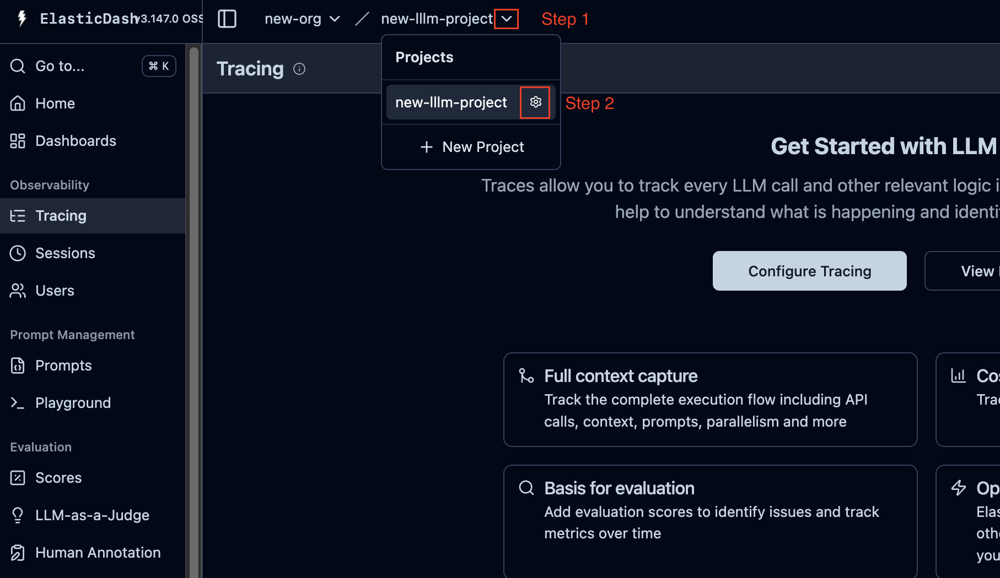
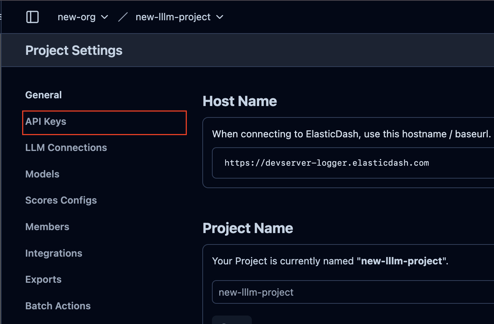

# Self-Hosting ElasticDash

This guide explains how to self-host ElasticDash in two phases: first, setting up the logger (trace ingestion and storage), then deploying the backend and dashboard for trace evaluation and visualization.

---

## Phase 1: Deploy ElasticDash Logger

**Recommended Machine Specs:**

- 4-core CPU
- 8 GB RAM
- 500 GB storage

Sample instance: AWS c6i.xlarge

### 1. Start the Logger

Clone the ElasticDash Logger repository and start the services:

```bash
git clone https://github.com/ElasticDash/ElasticDash-Logger
cd ElasticDash-Logger
cp .env.prod.example .env # Edit as needed, only this file supports docker setup
sudo docker compose up -d
```

If you choose not to use docker, you will need to check the provided .env templates and find the one suits your need best.

### 2. Create User and Project

 Open the Logger web UI in your browser (default: <http://localhost:3000>). For production, use a custom domain name.

### 3. Obtain API Keys

- Go to the project configuration page



- Go to the "API Keys" page



- Create a new API key set, and you will obtain a **Public Key** and a **Secret Key**.
- Note the Logger's base URL (e.g., `http://<your-logger-host>:3000`)

### 4. Integrate SDK

- Use the public/secret keys and logger base URL to configure the ElasticDash SDK in your LLM application
- See the [SDK Overview](./sdk-overview.md) for integration details

---

## Phase 2: Deploy Backend & Dashboard

**Recommended Machine Specs:**

- 2-core CPU
- 4 GB RAM
- 16 GB storage

Sample instance: AWS t2.medium

### 1. Start Backend and Dashboard

Clone the ElasticDash Backend and Dashboard repositories and start the services:

```bash
git clone https://github.com/ElasticDash/ElasticDash-BE
cd ElasticDash-BE
cp .env.example .env # Edit and set ClickHouse URL from Phase 1
npm run dev # Can use other processes like pm2 to sustain it

# Repeat for dashboard
cd ../
git clone https://github.com/ElasticDash/ElasticDash-Dashboard
cd ../ElasticDash-Dashboard
cp .env.example .env # Edit as needed
npm run dev # Can use other processes like pm2 to sustain it
```

- Set the **ClickHouse URL** in the backend's `.env` file to point to the ClickHouse instance from Phase 1

---

## Final Steps

- Access the dashboard in your browser (default: <http://localhost:8080>)
- You should now be able to view, evaluate, and manage traces, test cases, and test runs from your self-hosted instance.

---

**Note:**

- For production, consider securing your services and using managed storage.
- For more details, see the [Architecture Overview](./architecture.md).
